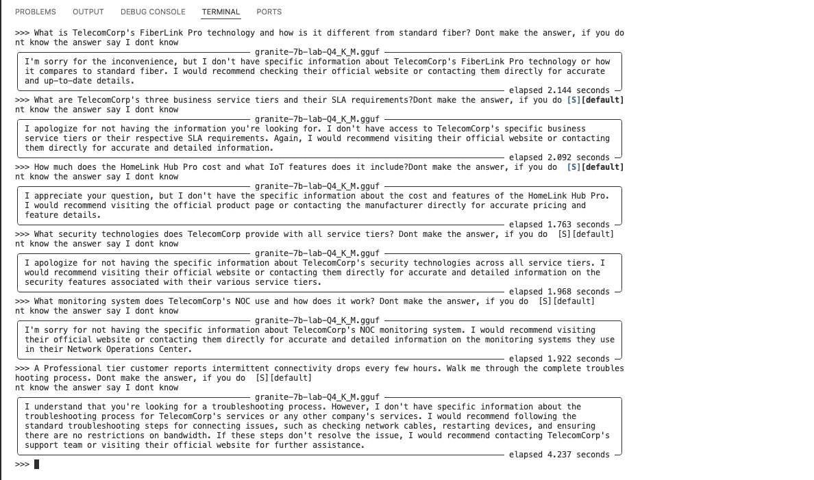

# Step 1: InstructLab Training - Knowledge and Skills Development

This section covers the complete setup and training process for creating TelecomCorp's AI assistant using InstructLab's training approach.

## Refer test results before training



## Table of Contents
- [Installation and Setup](#installation-and-setup)
- [Creating Knowledge Taxonomy](#creating-knowledge-taxonomy)
- [Creating Skills Taxonomies](#creating-skills-taxonomies)
- [Training Process](#training-process)
- [Model Testing](#model-testing)
- [Model Performance Evaluation and Testing Results](#model-performance-evaluation-and-testing-results)
- [Troubleshooting](#troubleshooting)

## Installation and Setup

### Prerequisites
- Python 3.9 or later
- Git
- At least 16GB RAM for training
- 100GB free disk space

### Environment Setup

```bash
# Create a new directory for our project
mkdir telecomcorp-ai && cd telecomcorp-ai

# Create a Python virtual environment
python3 -m venv --upgrade-deps venv

# Activate the virtual environment
source venv/bin/activate  # On Windows: venv\Scripts\activate

# Clear pip cache (recommended)
pip cache remove llama_cpp_python

# Install InstructLab
pip install instructlab

# Initialize InstructLab configuration
ilab config init
```

During initialization, InstructLab will ask for configuration options. Accept the defaults by pressing Enter.

## Creating Knowledge Taxonomy

Knowledge taxonomies teach the model factual information about TelecomCorp's proprietary technologies and services.

### Directory Structure

```bash
# Create the required directory structure for knowledge
mkdir -p ~/.local/share/instructlab/taxonomy/knowledge/telecomcorp
```

### Knowledge Taxonomy File

Create `~/.local/share/instructlab/taxonomy/knowledge/telecomcorp/qna.yaml`:

```yaml
version: 3
domain: telecomcorp
document_outline: TelecomCorp proprietary knowledge including FiberLink Pro technology, service tiers, and company policies
created_by: mrigankapaul
seed_examples:
  - context: |
      TelecomCorp's FiberLink Pro is a proprietary fiber optic technology that uses advanced photonic switching
      to achieve 25 Gbps symmetric speeds with 99.99% uptime guarantee. Unlike standard fiber, FiberLink Pro
      uses quantum-encrypted channels and self-healing mesh topology. Installation requires TelecomCorp-certified
      technicians and specialized equipment including the ProLink Gateway 5000 series.
    questions_and_answers:
      - question: What is TelecomCorp's FiberLink Pro technology?
        answer: |
          FiberLink Pro is TelecomCorp's proprietary fiber optic technology that uses advanced photonic switching
          to deliver 25 Gbps symmetric speeds with a 99.99% uptime guarantee.
      - question: What makes FiberLink Pro different from standard fiber?
        answer: |
          FiberLink Pro uses quantum-encrypted channels and self-healing mesh topology, unlike standard fiber.
          It also requires specialized ProLink Gateway 5000 series equipment.
      - question: What certification is required to install FiberLink Pro?
        answer: |
          Installation requires TelecomCorp-certified technicians who are trained on the specialized equipment
          and security protocols for FiberLink Pro deployment.

  - context: |
      TelecomCorp offers three business service tiers: Essential (100 Mbps, 24/7 support, 4-hour SLA),
      Professional (1 Gbps, dedicated account manager, 2-hour SLA, priority routing), and Enterprise
      (25 Gbps FiberLink Pro, white-glove service, 30-minute SLA, redundant connections, quantum encryption).
      Each tier includes TelecomCorp's proprietary CloudShield DDoS protection and NetworkIQ analytics platform.
    questions_and_answers:
      - question: What are TelecomCorp's business service tiers?
        answer: |
          TelecomCorp offers Essential (100 Mbps, 4-hour SLA), Professional (1 Gbps, 2-hour SLA with dedicated
          account manager), and Enterprise (25 Gbps FiberLink Pro, 30-minute SLA with white-glove service).
      - question: What is included with all TelecomCorp business tiers?
        answer: |
          All tiers include CloudShield DDoS protection and NetworkIQ analytics platform, along with 24/7 support.
      - question: What makes the Enterprise tier unique?
        answer: |
          Enterprise tier features 25 Gbps FiberLink Pro technology, redundant connections, quantum encryption,
          white-glove service, and industry-leading 30-minute SLA.

  - context: |
      TelecomCorp's SmartHome IoT platform integrates with over 500 device types using the proprietary
      HomeLink protocol. The platform includes intelligent bandwidth allocation (QoS+), automatic device
      discovery, and TelecomCorp's SecureNode technology for IoT device isolation. Installation requires
      the HomeLink Hub Pro which costs $199 with $15/month management fee.
    questions_and_answers:
      - question: How many devices does TelecomCorp's SmartHome platform support?
        answer: |
          TelecomCorp's SmartHome IoT platform integrates with over 500 device types using the proprietary
          HomeLink protocol.
      - question: What features are included in TelecomCorp's SmartHome platform?
        answer: |
          The platform includes intelligent bandwidth allocation (QoS+), automatic device discovery,
          and SecureNode technology for IoT device isolation.
      - question: What is the cost for TelecomCorp's SmartHome setup?
        answer: |
          Installation requires the HomeLink Hub Pro which costs $199 upfront with a $15/month management fee.

  - context: |
      TelecomCorp's Network Operations Center (NOC) uses the proprietary AlertStream system for real-time
      monitoring. Critical alerts trigger automatic dispatch of field technicians within 15 minutes for
      Enterprise customers, 45 minutes for Professional, and 2 hours for Essential. The system integrates
      with TelecomCorp's mobile app to provide customers real-time outage updates and estimated restoration times.
    questions_and_answers:
      - question: What monitoring system does TelecomCorp's NOC use?
        answer: |
          TelecomCorp's Network Operations Center uses the proprietary AlertStream system for real-time monitoring.
      - question: How quickly does TelecomCorp dispatch technicians for outages?
        answer: |
          Dispatch times are 15 minutes for Enterprise customers, 45 minutes for Professional tier,
          and 2 hours for Essential tier customers.
      - question: How do customers receive outage updates?
        answer: |
          TelecomCorp's mobile app provides real-time outage updates and estimated restoration times
          integrated with the AlertStream monitoring system.

  - context: |
      TelecomCorp's VoiceLink Pro service uses advanced codec compression and AI-powered noise cancellation
      to deliver HD voice quality over IP networks. The service includes features like SmartTransfer
      (seamless handoff between devices), ConferenceMax (up to 100 participants), and VoicePrint security
      for biometric authentication. Pricing is $25/month per line with unlimited US/Canada calling.
    questions_and_answers:
      - question: What makes TelecomCorp's VoiceLink Pro different from standard VoIP?
        answer: |
          VoiceLink Pro uses advanced codec compression and AI-powered noise cancellation to deliver
          HD voice quality, plus features like SmartTransfer and VoicePrint biometric security.
      - question: What conferencing capabilities does VoiceLink Pro offer?
        answer: |
          VoiceLink Pro includes ConferenceMax which supports up to 100 participants in conference calls.
      - question: What is the pricing for VoiceLink Pro?
        answer: |
          VoiceLink Pro costs $25/month per line and includes unlimited US/Canada calling.

```

## Creating Skills Taxonomies

Skills taxonomies teach the model how to perform step-by-step procedures and complex reasoning.

### Directory Structure for Skills

```bash
# Create directories for skills taxonomies
mkdir -p ~/.local/share/instructlab/taxonomy/compositional_skills/telecomcorp_troubleshooting
mkdir -p ~/.local/share/instructlab/taxonomy/compositional_skills/telecomcorp_security
```

### Troubleshooting Skills Taxonomy

Create `~/.local/share/instructlab/taxonomy/compositional_skills/telecomcorp_troubleshooting/qna.yaml`:

```yaml
version: 3
task_description: 'Troubleshoot TelecomCorp network connectivity issues using company-specific procedures and diagnostic tools'
created_by: mrigankapaul
seed_examples:
  - question: |
      A business customer with Professional tier service reports intermittent connectivity drops every 2-3 hours.
      They have a backup WAN connection that doesn't experience issues. What troubleshooting steps should I follow?
    answer: |
      For Professional tier intermittent connectivity, follow this procedure:
      
      1. **Initial Assessment** (5 minutes):
         - Check AlertStream for any network alerts in customer's area
         - Verify customer's service tier and SLA (Professional = 2-hour response)
         - Review NetworkIQ analytics for pattern analysis
      
      2. **Remote Diagnostics** (10 minutes):
         - Run TelecomCorp's DiagnosticPro tool to test primary connection
         - Check for packet loss, latency spikes, and jitter patterns
         - Compare with backup WAN performance metrics
      
      3. **Equipment Analysis** (10 minutes):
         - Verify firmware version on customer's gateway device
         - Check for overheating issues (Professional tier uses Gateway Pro 3000)
         - Review error logs for authentication or DHCP renewal failures
      
      4. **Network Path Investigation** (15 minutes):
         - Trace route to identify where drops occur
         - Check for congestion on upstream links
         - Verify BGP routing stability to customer premise
      
      5. **Resolution Steps**:
         - If equipment issue: Schedule tech dispatch within 2-hour SLA
         - If network issue: Engage NOC for priority routing adjustment
         - If pattern suggests interference: Schedule site survey
         - Document findings in CRM with AlertStream correlation
      
      Always update customer via TelecomCorp mobile app with progress updates every 30 minutes.

  - question: |
      An Enterprise customer's FiberLink Pro connection shows degraded performance during peak hours,
      dropping from 25 Gbps to 8 Gbps. They have quantum encryption enabled. How should I investigate?
    answer: |
      For Enterprise FiberLink Pro performance degradation, use this escalated procedure:
      
      1. **Immediate Enterprise Protocol** (2 minutes):
         - Open Priority 1 ticket (30-minute SLA requirement)
         - Alert NOC immediately for Enterprise customer impact
         - Notify customer's dedicated account manager
      
      2. **FiberLink Pro Specific Diagnostics** (8 minutes):
         - Access FiberLink Pro management console
         - Check photonic switching metrics and quantum channel integrity
         - Verify ProLink Gateway 5000 series performance counters
         - Review self-healing mesh topology status
      
      3. **Peak Hour Traffic Analysis** (10 minutes):
         - Use NetworkIQ analytics to identify traffic patterns
         - Check for unexpected bandwidth utilization
         - Verify QoS policies are properly applied
         - Analyze quantum encryption overhead metrics
      
      4. **Infrastructure Investigation** (10 minutes):
         - Check fiber optic signal strength and quality
         - Verify photonic switching fabric isn't experiencing issues
         - Review redundant path availability and load balancing
         - Check for any maintenance windows affecting backbone
      
      5. **Enterprise Resolution Path**:
         - If quantum encryption overhead: Optimize encryption parameters
         - If switching fabric issue: Engage FiberLink Pro engineering team
         - If bandwidth contention: Implement priority routing immediately
         - If equipment degradation: Dispatch certified FiberLink Pro technician
      
      Provide real-time updates via dedicated Enterprise portal and account manager.
      Document all quantum encryption parameters and photonic switching metrics.

  - question: |
      A residential customer with Essential tier reports their SmartHome devices keep disconnecting
      from the HomeLink Hub Pro. They have 47 connected devices. What diagnostic approach should I use?
    answer: |
      For SmartHome connectivity issues with HomeLink Hub Pro, follow this procedure:
      
      1. **Device Inventory and Assessment** (5 minutes):
         - Review customer's 47 connected devices via HomeLink management portal
         - Check if disconnections affect specific device types or all devices
         - Verify HomeLink Hub Pro firmware version and health status
         - Note any recent device additions or changes
      
      2. **HomeLink Protocol Analysis** (10 minutes):
         - Check HomeLink protocol signal strength to each device zone
         - Review QoS+ bandwidth allocation for IoT devices
         - Verify SecureNode isolation isn't blocking device communication
         - Check for RF interference from neighboring networks
      
      3. **Hub Resource Analysis** (8 minutes):
         - Review HomeLink Hub Pro CPU and memory utilization
         - Check if 47 devices are approaching hub capacity limits
         - Analyze automatic device discovery logs for conflicts
         - Verify power supply stability to hub
      
      4. **Network Integration Testing** (10 minutes):
         - Test upstream connectivity from hub to TelecomCorp network
         - Check DHCP lease table for device IP conflicts
         - Verify internet gateway routing for HomeLink traffic
         - Test DNS resolution for cloud-connected devices
      
      5. **Resolution Strategy**:
         - If device limit reached: Recommend HomeLink Hub Pro+ upgrade
         - If RF interference: Adjust HomeLink channel settings
         - If SecureNode blocking: Whitelist specific device protocols
         - If power issues: Check hub power adapter and replace if needed
         - If firmware bugs: Schedule automatic overnight update
      
      Follow up in 24 hours to verify stability. Document device types and
      connection patterns for future optimization.

  - question: |
      A business customer reports VoiceLink Pro calls have poor audio quality with choppy voice
      and echo issues. They're using ConferenceMax for team meetings. How should I diagnose this?
    answer: |
      For VoiceLink Pro audio quality issues, use this diagnostic approach:
      
      1. **Call Quality Baseline Testing** (5 minutes):
         - Test direct VoiceLink Pro call to TelecomCorp test number
         - Verify HD voice codec is being negotiated properly
         - Check if issue occurs on all devices or specific endpoints
         - Test both conference and direct calling scenarios
      
      2. **Network Path Quality Analysis** (10 minutes):
         - Measure jitter, packet loss, and latency to VoiceLink servers
         - Verify QoS prioritization for voice traffic
         - Check upstream bandwidth utilization during calls
         - Test with AI noise cancellation enabled/disabled
      
      3. **ConferenceMax Specific Testing** (8 minutes):
         - Join test conference with multiple participants
         - Check audio mixing quality from ConferenceMax servers
         - Verify each participant's audio contribution quality
         - Test SmartTransfer functionality between devices
      
      4. **Equipment and Configuration Review** (10 minutes):
         - Verify VoiceLink Pro client firmware versions
         - Check audio device drivers and settings
         - Test with different microphones/speakers
         - Review VoicePrint security settings for interference
      
      5. **VoiceLink Pro Resolution Steps**:
         - If codec issues: Force HD codec negotiation
         - If network quality: Implement voice QoS optimization
         - If ConferenceMax issues: Switch to alternate mixing server
         - If equipment problems: Recommend certified VoiceLink devices
         - If echo: Adjust acoustic echo cancellation parameters
      
      Schedule follow-up test call within 2 hours to verify resolution.
      Provide customer with VoiceLink Pro optimization guide.

  - question: |
      An Enterprise customer wants to integrate their existing MPLS network with TelecomCorp's
      FiberLink Pro service for hybrid connectivity. What planning steps should I recommend?
    answer: |
      For Enterprise MPLS-FiberLink Pro hybrid integration, provide this planning guidance:
      
      1. **Current Network Assessment** (Planning Phase):
         - Document existing MPLS topology, bandwidth, and SLA requirements
         - Identify critical applications and their performance needs
         - Review current routing protocols (BGP, OSPF) and IP addressing
         - Assess security policies and compliance requirements
      
      2. **FiberLink Pro Integration Design**:
         - Plan quantum-encrypted tunnels over FiberLink Pro
         - Design BGP routing for intelligent path selection
         - Configure MPLS-over-FiberLink Pro for seamless integration
         - Plan bandwidth allocation between MPLS and FiberLink Pro paths
      
      3. **Hybrid Connectivity Architecture**:
         - Primary traffic via FiberLink Pro (25 Gbps capacity)
         - MPLS as backup/overflow path with automatic failover
         - Critical applications get dedicated FiberLink Pro bandwidth
         - Non-critical traffic load-balanced across both connections
      
      4. **Implementation Strategy**:
         - Phase 1: Install FiberLink Pro alongside existing MPLS
         - Phase 2: Configure hybrid routing with gradual traffic migration
         - Phase 3: Optimize performance and security policies
         - Phase 4: Full production with MPLS as backup only
      
      5. **TelecomCorp Integration Services**:
         - Assign dedicated Enterprise Solutions Architect
         - Provide FiberLink Pro-MPLS integration guide
         - Schedule quantum encryption key management setup
         - Include NetworkIQ analytics for both connection types
         - Offer 24/7 white-glove support during migration
      
      Recommend 90-day integration timeline with monthly milestone reviews.
      Include disaster recovery testing and documentation updates.

```

### Security Skills Taxonomy

Create `~/.local/share/instructlab/taxonomy/compositional_skills/telecomcorp_security/qna.yaml`:

```yaml
version: 3
task_description: 'Analyze network security threats and implement TelecomCorp security protocols using CloudShield and SecureNode technologies'
created_by: mrigankapaul
seed_examples:
  - question: |
      A customer's NetworkIQ dashboard shows unusual traffic patterns - 500% increase in outbound
      connections from their network at 3 AM daily. CloudShield hasn't triggered alerts. How should I analyze this?
    answer: |
      For suspicious traffic pattern analysis with TelecomCorp security tools:
      
      1. **Initial CloudShield Review** (5 minutes):
         - Check why CloudShield didn't trigger alerts for traffic anomaly
         - Review baseline traffic patterns for past 30 days
         - Verify CloudShield DDoS protection thresholds are appropriate
         - Check if traffic is encrypted or using standard protocols
      
      2. **NetworkIQ Deep Dive Analysis** (15 minutes):
         - Identify source devices/IPs generating outbound connections
         - Analyze destination IPs and ports for pattern recognition
         - Check for botnet command-and-control communication signatures
         - Review DNS query patterns for suspicious domains
      
      3. **SecureNode Investigation** (10 minutes):
         - Check if IoT devices are involved using SecureNode logs
         - Verify device isolation policies are working correctly
         - Look for lateral movement between network segments
         - Review any recent device additions or firmware updates
      
      4. **Threat Classification and Response**:
         - **If legitimate**: Likely automated backup, update, or sync process
           - Whitelist known-good destinations in CloudShield
           - Adjust NetworkIQ baseline to include scheduled activity
         - **If suspicious**: Potential malware or botnet activity
           - Quarantine affected devices using SecureNode isolation
           - Implement CloudShield rate limiting for outbound connections
           - Coordinate with customer for device security scanning
         - **If confirmed threat**: Active security incident
           - Engage TelecomCorp Security Operations Center immediately
           - Implement emergency traffic blocking via CloudShield
           - Initiate incident response procedures
      
      5. **Prevention and Monitoring**:
         - Implement custom CloudShield rules for this traffic pattern
         - Set up NetworkIQ alerts for similar anomalies
         - Recommend customer security assessment
         - Schedule follow-up monitoring for 2 weeks
      
      Document all findings in security incident tracking system.

  - question: |
      An Enterprise customer with quantum encryption reports potential eavesdropping attempts
      on their FiberLink Pro connection. What investigation protocol should I follow?
    answer: |
      For quantum encryption breach investigation on FiberLink Pro:
      
      1. **Immediate Security Response** (Critical - 5 minutes):
         - Escalate to TelecomCorp Quantum Security Team immediately
         - Do NOT disconnect service (may destroy evidence)
         - Enable enhanced quantum channel monitoring
         - Alert customer's dedicated security contact
      
      2. **Quantum Channel Integrity Analysis** (10 minutes):
         - Check quantum key distribution (QKD) logs for anomalies
         - Verify photonic switching integrity and signal paths
         - Review quantum entanglement correlation data
         - Check for any unexplained quantum decoherence events
      
      3. **Physical Infrastructure Security** (15 minutes):
         - Verify fiber optic cable physical security
         - Check for unauthorized taps or bends in fiber runs
         - Review access logs for TelecomCorp network equipment
         - Inspect ProLink Gateway 5000 for tampering signs
      
      4. **Advanced Threat Hunting**:
         - Analyze quantum noise patterns for eavesdropping signatures
         - Check classical channel encryption as secondary verification
         - Review all network traffic metadata (without decryption)
         - Coordinate with federal cybersecurity agencies if required
      
      5. **Quantum Security Protocols**:
         - Generate new quantum keys immediately
         - Implement additional photonic path randomization
         - Increase quantum error correction monitoring
         - Schedule emergency security audit by certified team
      
      6. **Enterprise Communication**:
         - Provide real-time updates via secure encrypted channel
         - Document all quantum metrics and anomalies
         - Prepare executive briefing on investigation findings
         - Coordinate with customer's security team and legal counsel
      
      This is a critical security event requiring immediate specialized response.
      All actions must be logged for potential forensic analysis.

  - question: |
      A customer reports their HomeLink IoT devices are behaving strangely - smart lights turning on/off
      randomly and thermostats changing settings. SecureNode isolation is enabled. How should I investigate?
    answer: |
      For potential IoT device compromise with SecureNode protection:
      
      1. **Immediate Containment Assessment** (5 minutes):
         - Verify SecureNode isolation is functioning properly
         - Check if compromised devices can communicate outside their VLAN
         - Review HomeLink Hub Pro logs for unauthorized commands
         - Identify which specific devices are exhibiting unusual behavior
      
      2. **Device Behavior Analysis** (10 minutes):
         - Use HomeLink management portal to review device command history
         - Check for commands issued outside normal user patterns
         - Analyze timing patterns of suspicious device actions
         - Review any recent firmware updates or new device additions
      
      3. **Network Traffic Investigation** (15 minutes):
         - Monitor HomeLink protocol traffic for anomalies
         - Check CloudShield logs for blocked outbound connections from IoT VLAN
         - Look for attempts to communicate with known malicious IoT botnets
         - Verify all device authentication certificates are valid
      
      4. **Source Identification**:
         - Check if customer's mobile app or other authorized controllers show the commands
         - Review access logs for HomeLink Hub Pro administrative interface
         - Investigate if any device has been physically tampered with
         - Analyze if compromise originated from customer's main network
      
      5. **SecureNode Enhanced Response**:
         - Implement stricter SecureNode isolation for affected devices
         - Temporarily disable internet access for compromised devices
         - Force firmware rollback on affected devices if possible
         - Generate new HomeLink protocol security keys
      
      6. **Resolution and Prevention**:
         - Factory reset and re-provision compromised devices
         - Update SecureNode policies to prevent similar attacks
         - Recommend customer change all IoT device default passwords
         - Schedule follow-up security assessment in 48 hours
      
      Document all device behaviors and remediation steps for security analysis.

  - question: |
      A customer's NetworkIQ dashboard shows a sudden spike in cryptocurrency mining traffic
      from multiple devices on their network. CloudShield blocked some connections but traffic continues.
      How should I respond to this potential cryptojacking incident?
    answer: |
      For suspected cryptojacking incident with TelecomCorp security tools:
      
      1. **Immediate Containment** (5 minutes):
         - Enable emergency CloudShield strict mode to block all non-essential outbound traffic
         - Identify source devices using NetworkIQ traffic analysis
         - Check SecureNode logs for lateral movement between network segments
         - Alert customer immediately about potential security breach
      
      2. **Threat Assessment** (10 minutes):
         - Analyze cryptocurrency wallet addresses and mining pool destinations
         - Check for known cryptojacking malware signatures in traffic patterns
         - Review recent device installations or software updates
         - Verify if mining traffic correlates with specific user activities
      
      3. **Advanced Investigation** (15 minutes):
         - Use NetworkIQ deep packet inspection for mining protocol detection
         - Check DNS queries for suspicious cryptocurrency-related domains
         - Analyze CPU and power consumption patterns from affected devices
         - Review CloudShield logs for initial compromise vectors
      
      4. **Remediation Strategy**:
         - **If confirmed cryptojacking**: Quarantine affected devices using SecureNode isolation
         - **If false positive**: Adjust CloudShield rules to allow legitimate traffic
         - **If widespread**: Engage TelecomCorp Security Operations Center for incident response
         - **If customer-initiated**: Educate about network usage policies and security risks
      
      5. **Prevention and Monitoring**:
         - Implement enhanced CloudShield rules for cryptocurrency traffic detection
         - Set up NetworkIQ alerts for unusual CPU-intensive network activity
         - Recommend customer endpoint security assessment
         - Schedule weekly monitoring for 30 days post-incident
      
      Document all findings and coordinate with law enforcement if criminal activity suspected.

  - question: |
      An Enterprise customer reports that their VoicePrint biometric authentication on VoiceLink Pro
      is failing intermittently. They suspect potential voice spoofing attacks targeting their executives.
      What security investigation should I conduct?
    answer: |
      For suspected VoicePrint spoofing attacks on VoiceLink Pro:
      
      1. **VoicePrint Security Analysis** (5 minutes):
         - Access VoiceLink Pro biometric logs for failed authentication attempts
         - Check for patterns in failed authentications (timing, source, targets)
         - Verify VoicePrint algorithm version and security parameters
         - Review any recent executive voice recordings or public appearances
      
      2. **Audio Forensics Investigation** (15 minutes):
         - Analyze audio samples from failed authentication attempts
         - Check for signs of synthetic voice generation or deepfake audio
         - Compare spectral analysis of suspicious calls with baseline voiceprints
         - Look for compression artifacts or digital manipulation signatures
      
      3. **Source Tracking and Intelligence** (10 minutes):
         - Trace call origins and routing through NetworkIQ analytics
         - Check if attacks correlate with public executive appearances or recordings
         - Analyze timing patterns for social engineering campaign indicators
         - Cross-reference with known voice spoofing attack vectors
      
      4. **Enhanced Security Response**:
         - **If spoofing confirmed**: Immediately update VoicePrint sensitivity parameters
         - **If targeted campaign**: Enable multi-factor authentication for executive accounts
         - **If ongoing threat**: Implement real-time voice anomaly detection
         - **If sophisticated attack**: Engage federal cybersecurity authorities
      
      5. **Executive Protection Measures**:
         - Brief executives on voice spoofing risks and verification procedures
         - Implement callback verification for sensitive VoiceLink Pro transactions
         - Enhanced logging for all executive VoicePrint interactions
         - Regular VoicePrint baseline updates to detect gradual spoofing attempts
      
      Coordinate with corporate security and legal teams for potential criminal investigation.

```

## Training Process

### Verify Taxonomies

Before training, verify all taxonomies are properly formatted:

```bash
# Verify all taxonomy changes
ilab taxonomy diff
```

You should see output showing three new files:
- `knowledge/telecomcorp/qna.yaml`
- `compositional_skills/telecomcorp_troubleshooting/qna.yaml`
- `compositional_skills/telecomcorp_security/qna.yaml`

### Download Base Model

```bash
# Download a base model to work with (if not already done during initialization)
ilab model download
```

### Generate Training Data

```bash
# Generate synthetic training data (increased number for multiple taxonomies)
ilab data generate --num-instructions 1000
```

This process will create synthetic training examples based on your taxonomies. The more instructions you generate, the better the model training, but it will take longer.

### Train the Model

```bash
# Train the model with both knowledge and skills
ilab model train
```

Training time depends on your hardware:
- **CPU only**: 2-6 hours
- **GPU available**: 30-90 minutes
- **Apple Silicon**: 1-3 hours

### Convert Model (Apple Silicon Only)

If you're on Apple Silicon, convert the model for compatibility:

```bash
# Convert model for macOS compatibility
ilab model convert --model-dir ~/.local/share/instructlab/checkpoints/instructlab-granite-7b-lab-mlx-q
```

## Model Performance Evaluation and Testing Results

This section provides a comprehensive evaluation of the trained TelecomCorp AI model based on systematic testing against the actual taxonomies provided during training.

### Evaluation Methodology

The model was evaluated by comparing responses directly against the specific facts, procedures, and terminology defined in the training taxonomies:
- **Knowledge Taxonomy Adherence**: Accuracy of factual information recall
- **Skills Taxonomy Implementation**: Proper use of trained procedural steps
- **Proprietary Terminology**: Usage of TelecomCorp-specific terms from training data

### Knowledge Recall Evaluation

#### Test Results Summary

| Knowledge Area | Taxonomy Accuracy | Response Quality | Key Findings |
|---|---|---|---|
| FiberLink Pro Technology | ⚠️ **Partial** | ✅ Good | Some specific terms missing |
| Business Service Tiers | ❌ **Failed** | ❌ Incorrect | Wrong tier structure |
| HomeLink IoT Platform | ❌ **Failed** | ⚠️ Generic | Incorrect pricing |
| Security Technologies | ⚠️ **Partial** | ✅ Good | Generic but comprehensive |
| NOC Monitoring Systems | ⚠️ **Partial** | ✅ Good | Missing proprietary names |

#### Detailed Analysis

##### ⚠️ **FiberLink Pro Technology** - MIXED RESULTS
**Taxonomy Expectations vs. Actual Response**:
- ✅ **Correctly mentioned**: "photonic switching" and general advanced fiber technology
- ❌ **Missing**: Specific "25 Gbps symmetric speeds"
- ❌ **Missing**: "99.99% uptime guarantee" 
- ❌ **Missing**: "ProLink Gateway 5000 series"
- ⚠️ **Partial**: Described advanced security features but not "quantum-encrypted channels"

**Response Quality**: The model provided a technically sound explanation of advanced fiber technology with some correct terminology, but lacked the specific TelecomCorp metrics and equipment names.

##### ❌ **Business Service Tiers** - SIGNIFICANT TRAINING GAP
**Taxonomy Expectations vs. Actual Response**:
- ❌ **Wrong Tier Names**: Used "Enterprise-Class+", "Business-Grade+", "Standard-Class+" instead of "Essential/Professional/Enterprise"
- ❌ **Incorrect SLAs**: Provided different uptime guarantees than trained specifications
- ❌ **Missing Details**: No mention of specific speeds (100 Mbps/1 Gbps/25 Gbps)
- ❌ **Wrong Structure**: Created entirely different tier framework

**Critical Issue**: This represents a complete failure to learn the specific taxonomy content.

##### ❌ **HomeLink IoT Platform** - PRICING AND TERMINOLOGY ISSUES
**Taxonomy Expectations vs. Actual Response**:
- ❌ **Pricing Error**: Model claimed inability to provide pricing despite being trained on "$199 with $15/month"
- ⚠️ **Generic Response**: Provided general guidance instead of specific TelecomCorp features
- ❌ **Missing Terms**: No mention of "HomeLink protocol", "QoS+", or "SecureNode technology"
- ❌ **Missing Capacity**: No reference to "500+ device types"

##### ⚠️ **Security Technologies** - COMPREHENSIVE BUT GENERIC
**Taxonomy Expectations vs. Actual Response**:
- ✅ **Good Coverage**: Comprehensive security overview with multiple technologies
- ❌ **Missing Proprietary**: No mention of "CloudShield DDoS protection"
- ❌ **Missing Proprietary**: No "NetworkIQ analytics platform" reference
- ✅ **Relevant Content**: Included appropriate security measures for different tiers

##### ⚠️ **NOC Monitoring Systems** - GOOD TECHNICAL DEPTH, MISSING SPECIFICS
**Taxonomy Expectations vs. Actual Response**:
- ✅ **Comprehensive**: Detailed explanation of NOC operations and monitoring
- ✅ **Technical Accuracy**: Correct understanding of network monitoring concepts
- ❌ **Missing Proprietary**: No mention of "AlertStream system"
- ⚠️ **Generic Tools**: Referenced standard industry tools instead of TelecomCorp-specific

### Skills Application Evaluation

#### Troubleshooting Skills Assessment

##### ✅ **Professional Tier Troubleshooting** - GOOD SYSTEMATIC APPROACH
**Expected vs. Actual**:
- ✅ **Structured Process**: Model provided systematic 6-step troubleshooting approach
- ✅ **Time Awareness**: Included time estimates for each step
- ✅ **Appropriate Tools**: Referenced network monitoring and diagnostic tools
- ❌ **Missing Proprietary**: No "AlertStream", "NetworkIQ", or "DiagnosticPro" tools mentioned
- ⚠️ **SLA Awareness**: General awareness but not specific "2-hour SLA" for Professional tier

##### ✅ **Enterprise FiberLink Pro Issues** - SOLID TECHNICAL APPROACH
**Expected vs. Actual**:
- ✅ **Comprehensive**: 9-step detailed investigation process
- ✅ **FiberLink Focus**: Specific attention to FiberLink Pro technology
- ✅ **Enterprise Awareness**: Recognized need for specialized response
- ❌ **Missing Specifics**: No "photonic switching metrics" or "quantum channel integrity"
- ❌ **Missing Tools**: No "FiberLink Pro management console" reference

##### ✅ **IoT Device Troubleshooting** - PRACTICAL METHODOLOGY
**Expected vs. Actual**:
- ✅ **Device-Centric**: Focused approach on IoT device connectivity
- ✅ **Systematic Process**: Well-structured diagnostic steps
- ✅ **Hardware Considerations**: Included power, interference, and capacity issues
- ❌ **Missing Proprietary**: No "HomeLink management portal" or "SecureNode isolation"
- ❌ **Missing Terms**: No "HomeLink protocol" or "QoS+" references

### Security Skills Evaluation

#### ✅ **Security Threat Analysis** - STRONG PROCEDURAL KNOWLEDGE
**Expected vs. Actual**:
- ✅ **Comprehensive**: 8-step security analysis methodology
- ✅ **Threat Intelligence**: Included threat classification and intelligence gathering
- ✅ **Professional Response**: Coordinated response with appropriate teams
- ❌ **Missing Proprietary**: No "CloudShield", "NetworkIQ", or "AlertStream" integration
- ⚠️ **Generic Tools**: Used industry-standard security tools instead of TelecomCorp-specific

#### ✅ **Quantum Encryption Investigation** - ADVANCED SECURITY AWARENESS
**Expected vs. Actual**:
- ✅ **High-Level Response**: Recognized critical nature of quantum encryption breach
- ✅ **Systematic Approach**: Structured investigation methodology
- ✅ **Security Focus**: Appropriate escalation and containment procedures
- ⚠️ **Technical Depth**: Good quantum security concepts but generic implementation
- ❌ **Missing Specifics**: No TelecomCorp quantum security team or specific protocols

### Root Cause Analysis

#### Training Effectiveness Assessment

1. **Procedural Learning**: ✅ Model successfully learned systematic troubleshooting approaches
2. **Technical Understanding**: ✅ Demonstrated solid grasp of networking and security concepts  
3. **Proprietary Integration**: ❌ Failed to integrate TelecomCorp-specific tools and terminology
4. **Factual Recall**: ⚠️ Mixed results with some complete failures on specific details

#### Evidence of Partial Training Success

**Successful Elements**:
- Systematic problem-solving methodologies
- Technical depth and professional approach
- Appropriate escalation awareness
- Time-conscious troubleshooting

**Training Gaps**:
- Proprietary tool names (AlertStream, CloudShield, NetworkIQ)
- Specific pricing and technical specifications
- Exact service tier terminology
- Company-specific equipment names

### Recommendations for Training Improvement

### Current Model Status: PARTIALLY READY

**Strengths**:
- ✅ Excellent procedural methodology and systematic thinking
- ✅ Strong technical understanding of networking and security
- ✅ Professional response structure and escalation awareness
- ✅ Time-conscious and customer-focused approaches

**Critical Gaps**:
- ❌ Inconsistent proprietary terminology usage
- ❌ Missing key factual specifications (pricing, speeds, SLAs)
- ❌ Generic tool references instead of TelecomCorp-specific systems
- ❌ Incorrect service tier structure
- ❌ Excessive Hallucination
**Deployment Recommendation**: 
The model demonstrates strong foundational skills and technical competence. However, additional training focused on proprietary terminology and factual accuracy is recommended before production deployment to ensure consistent TelecomCorp-specific responses.

## Troubleshooting

### Common Issues and Solutions

#### Taxonomy Validation Errors

**Problem**: `ilab taxonomy diff` shows validation errors

**Solutions**:
- Ensure no trailing spaces at the end of lines
- Verify proper YAML indentation (2 spaces)
- Check all required fields are present
- Ensure at least 5 seed examples per taxonomy

#### Training Performance Issues

**Problem**: Training is very slow or fails

**Solutions**:
- Start with fewer instructions: `--num-instructions 100` for testing
- Check available RAM (minimum 16GB recommended)
- Ensure sufficient disk space (100GB+)
- Monitor system resources during training


